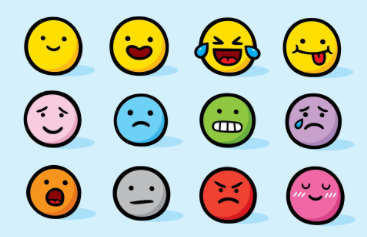

# 👋 Hi, I'm Jiao Bao!

## 🙋🏻 About Me

I currently live in the USA 🇺🇸 (Eastern Standard Time 🕒) and I’m passionate about technology 🚀, coding 👨‍💻, and collaborating on innovative software, machine learning 🤖, and AI projects. I love connecting with the developer community 🌐👥. Outside of work and study, I enjoy playing games like Cyberpunk 🎮, exercising and lifting weights 🏋️, playing piano 🎹, and spending quality time with my family ❤️.

## 🔭 I'm currently working on 
This project fine-tunes DistilBERT on the GoEmotions dataset and maps the 28 original emotions to 6 Ekman emotions + neutral.

## ⚒️ My Skills

### 🌐 Languages

### 🤖 Machine Learning

### 🧰 Frameworks

### 🛠️ Developer Tools

### 📚 Libraries

